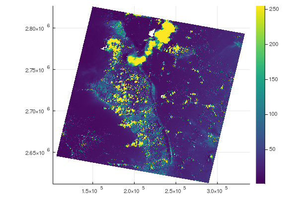

[](https://evetion.github.io/GeoArrays.jl/) [](https://travis-ci.org/evetion/GeoArrays.jl) [](https://ci.appveyor.com/project/evetion/GeoArrays-jl) [](https://codecov.io/gh/evetion/GeoArrays.jl)
# GeoArrays
Simple geographical raster interaction built on top of [ArchGDAL](https://github.com/yeesian/ArchGDAL.jl/), [GDAL](https://github.com/JuliaGeo/GDAL.jl) and [CoordinateTransformations](https://github.com/FugroRoames/CoordinateTransformations.jl).

A GeoArray is an AbstractArray, an AffineMap for calculating coordinates based on the axes and a CRS definition to interpret these coordinates into in the real world. It's three dimensional and can be seen as a stack (3d) of 2d geospatial rasters (bands), the dimensions are :x, :y, and :bands. The AffineMap and CRS (coordinates) only operate on the :x and :y dimensions.

This packages takes its inspiration from Python's [rasterio](https://github.com/mapbox/rasterio).

## Installation
```julia
(v1.3) pkg> add GeoArrays
```

## Examples
#### Basic Usage
```julia
julia> using GeoArrays

# Read TIF file
julia> fn = download("https://github.com/yeesian/ArchGDALDatasets/blob/master/data/utmsmall.tif?raw=true")
julia> geoarray = GeoArrays.read(fn)
100×100×1 GeoArray{UInt8}:
...

# Affinemap containing offset and scaling
julia> geoarray.f
AffineMap([60.0 0.0; 0.0 -60.0], [440720.0, 3.75132e6])

# WKT projection string
julia> geoarray.crs
GeoFormatTypes.WellKnownText{GeoFormatTypes.CRS,String}(GeoFormatTypes.CRS(), "PROJCS[\"NAD27 / UTM zone 11N\",GEOGCS[\"NAD27\",DATUM[\"North_American_Datum_1927\",SPHEROID[\"Clarke 1866\",6378206.4,294.978698213898,AUTHORITY[\"EPSG\",\"7008\"]],AUTHORITY[\"EPSG\",\"6267\"]],PRIMEM[\"Greenwich\",0],UNIT[\"degree\",0.0174532925199433,AUTHORITY[\"EPSG\",\"9122\"]],AUTHORITY[\"EPSG\",\"4267\"]],PROJECTION[\"Transverse_Mercator\"],PARAMETER[\"latitude_of_origin\",0],PARAMETER[\"central_meridian\",-117],PARAMETER[\"scale_factor\",0.9996],PARAMETER[\"false_easting\",500000],PARAMETER[\"false_northing\",0],UNIT[\"metre\",1,AUTHORITY[\"EPSG\",\"9001\"]],AXIS[\"Easting\",EAST],AXIS[\"Northing\",NORTH],AUTHORITY[\"EPSG\",\"26711\"]]")

# Create and write a TIFF
julia> ga = GeoArray(rand(100,200,3))
julia> GeoArrays.write!("test.tif", ga)
```

#### Using coordinates
```julia
# Find coordinates by index
julia> coords(geoarray, [1,1])
2-element StaticArrays.SArray{Tuple{2},Float64,1,2}:
 440720.0
      3.75132e6

# Find index by coordinates
julia> indices(geoarray, [440720.0, 3.75132e6])
2-element StaticArrays.SArray{Tuple{2},Int64,1,2}:
 1
 1

# Find all coordinates
julia> coords(geoarray)
101×101 Array{StaticArrays.SArray{Tuple{2},Float64,1,2},2}:
 [440720.0, 3.75132e6]  [440720.0, 3.75126e6]  [440720.0, 3.7512e6] ...
 ...
```
#### Manipulation
```julia
# Translate complete raster by x + 100
julia> trans = Translation(100, 0)
julia> compose!(ga, trans)


# Math with GeoArrays (- + * /)
julia> GeoArray(rand(5,5,1)) - GeoArray(rand(5,5,1))
5×5×1 GeoArray{Float64}:
[:, :, 1] =
 0.417168   0.253739  0.132952   0.0702787  0.34263
```

#### Interpolation
```julia
julia> using InverseDistanceWeighting  # or any solver from the GeoStats ecosystem
julia> ga = GeoArray(Array{Union{Missing, Float64}}(rand(5, 1)))
julia> ga.A[2,1] = missing
[:, :, 1] =
 0.6760718768442127
  missing
 0.852882193026649
 0.7137410453351622
 0.5949409082233854
julia> GeoArrays.interpolate!(ga, InvDistWeight(:z => (neighbors=3,)))
[:, :, 1] =
 0.6760718768442127
 0.7543298370153771
 0.852882193026649
 0.7137410453351622
 0.5949409082233854
```

#### Plotting
```julia
# Plot a GeoArray
julia> using Plots
julia> fn = download("https://github.com/yeesian/ArchGDALDatasets/blob/master/pyrasterio/RGB.byte.tif?raw=true")
julia> ga = GeoArrays.read(fn)
julia> plot(ga)

# or plot a band other than the first one
julia> plot(ga, band=2)
```

